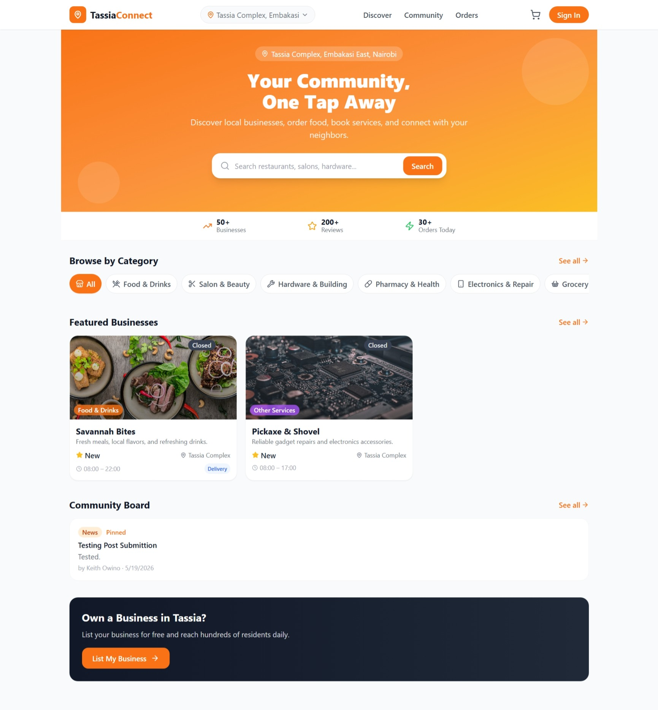
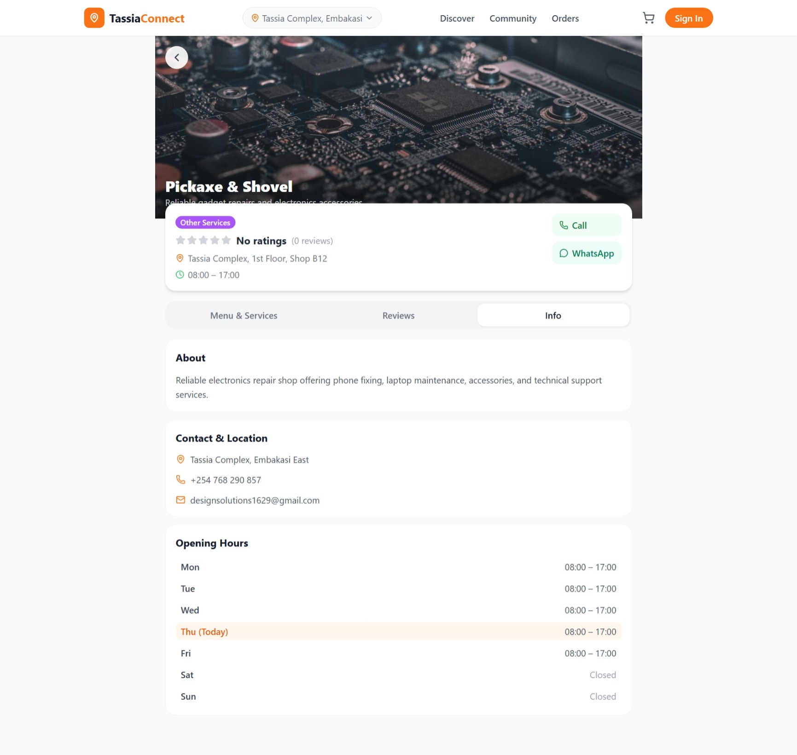
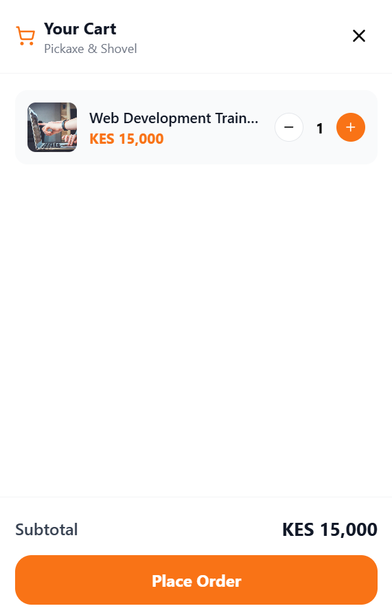
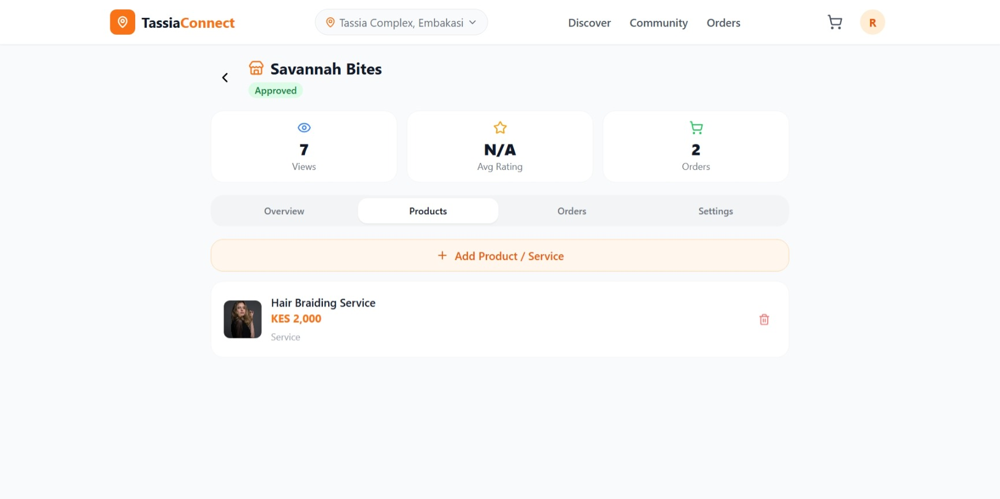
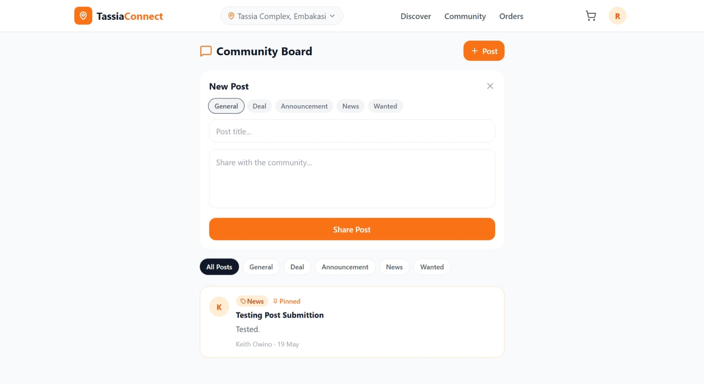
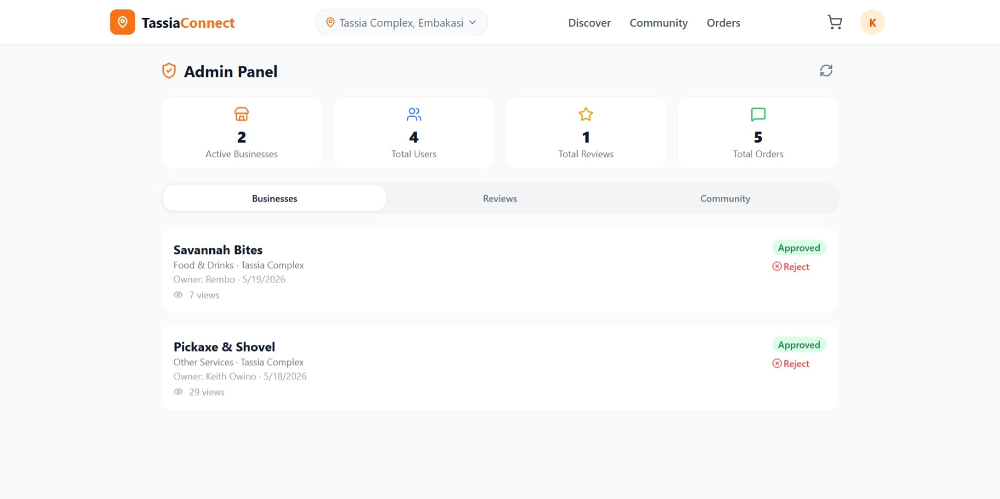

# Tassia Connect


## Overview

Tassia Connect is a community-centric e-commerce and business discovery platform built specifically for the Tassia Complex in Embakasi, Nairobi. As local entrepreneurship continues to grow, many small businesses still struggle with digital visibility while residents often miss nearby products and services.

Tassia Connect bridges this gap by creating a centralized local marketplace where businesses can showcase their offerings and community members can discover, shop, and engage with nearby vendors—all in one place.

### The Problem

Small businesses struggle with online visibility, while residents waste time searching for trusted local services and products.

### The Solution

A digital community marketplace where local businesses can list products and services, and residents can discover, order, review, and connect with nearby merchants.

**Live Demo:** https://tassia-connect.vercel.app/

---

## Key Features

### Customer Features

- **Discover Local Businesses** — Browse businesses by category or search by name/service
- **Shopping Cart** — Add products and services across multiple businesses
- **Order Tracking** — Track orders from pending to completion
- **Community Board** — Share announcements and interact with neighbors
- **Business Reviews** — Rate and review experiences
- **Favorites** — Save businesses for quick access
- **Delivery & Pickup Options** — Flexible fulfillment choices

### Business Owner Features

- **Business Dashboard** — Manage your storefront in one place
- **Product & Service Management** — Add, edit, and remove listings
- **Order Management** — Process and manage customer orders
- **Performance Analytics** — Monitor views, ratings, and activity
- **Business Submission Workflow** — Submit listings for approval

### Admin Features

- **Business Approval System** — Review and approve listings
- **Content Moderation** — Manage reviews and community posts
- **Platform Analytics** — Monitor ecosystem growth and activity

---

## Screenshots

### Home Page



_Landing page featuring hero content, categories, and featured businesses._

### Business Profile



_Detailed business page with products, services, reviews, and contact details._

### Shopping Cart



_Cart management and streamlined checkout flow._

### Business Dashboard



_Business management tools and analytics._

### Community Board



_Neighborhood announcements and discussions._

### Admin Panel



_Administration and moderation dashboard._

---

## Technology Stack

| Category         | Technology          |
| :--------------- | :------------------ |
| Frontend         | React 18 + Vite     |
| Styling          | Tailwind CSS        |
| Routing          | React Router DOM v6 |
| State Management | React Context API   |
| Icons            | Lucide React        |
| Backend          | Firebase            |
| Build Tool       | Vite                |

---

## Feature Access Matrix

| Feature                 | Customer | Business Owner | Admin |
| :---------------------- | :------: | :------------: | :---: |
| Browse businesses       |    ✓     |       ✓        |   ✓   |
| Place orders            |    ✓     |       ✓        |   ✓   |
| Write reviews           |    ✓     |       ✓        |   ✓   |
| Community interactions  |    ✓     |       ✓        |   ✓   |
| Manage business listing |    —     |       ✓        |   ✓   |
| Manage business orders  |    —     |       ✓        |   ✓   |
| Add/Edit products       |    —     |       ✓        |   ✓   |
| Approve businesses      |    —     |       —        |   ✓   |
| Moderate content        |    —     |       —        |   ✓   |
| View analytics          |    —     |       ✓        |   ✓   |

---

## Project Structure

```bash
tassia-connect/
├── public/
│   └── assets/
│
├── src/
│   ├── components/
│   │   ├── business/
│   │   ├── common/
│   │   ├── layout/
│   │   └── orders/
│   │
│   ├── lib/
│   │   ├── context/
│   │   │   ├── AuthContext.jsx
│   │   │   ├── CartContext.jsx
│   │   │   └── DataContext.jsx
│   │   │
│   │   └── firebase/
│   │
│   ├── pages/
│   │   ├── HomePage.jsx
│   │   ├── DiscoveryPage.jsx
│   │   ├── BusinessProfile.jsx
│   │   ├── CommunityPage.jsx
│   │   ├── CheckoutPage.jsx
│   │   ├── OrdersPage.jsx
│   │   ├── ProfilePage.jsx
│   │   ├── BusinessDashboardPage.jsx
│   │   └── AdminPage.jsx
│   │
│   ├── App.jsx
│   └── main.jsx
│
├── .env.example
├── package.json
├── vite.config.js
└── README.md
```

---

## Prerequisites

Before running the project locally, ensure you have:

- Node.js (v18+ recommended)
- npm or yarn
- Git
- Modern browser

---

## Installation & Setup

Clone the repository:

```bash
git clone https://github.com/keithowino/tassia-connect.git
```

Navigate into the project:

```bash
cd tassia-connect
```

Install dependencies:

```bash
npm install
```

Start development server:

```bash
npm run dev
```

Open:

```bash
http://localhost:5173
```

---

## Environment Variables

Create a `.env` file in the root directory:

```env
VITE_FIREBASE_API_KEY=your_api_key
VITE_FIREBASE_AUTH_DOMAIN=your_auth_domain
VITE_FIREBASE_PROJECT_ID=your_project_id
VITE_FIREBASE_STORAGE_BUCKET=your_storage_bucket
VITE_FIREBASE_MESSAGING_SENDER_ID=your_sender_id
VITE_FIREBASE_APP_ID=your_app_id
```

Refer to `client/.env.example` for guidance.

---

## Planned Enhancements

- M-Pesa integration
- Real-time order tracking
- Push notifications
- Image uploads
- Business verification system
- Delivery tracking
- Loyalty and rewards system
- Multi-language support (English + Swahili)
- Advanced filtering and recommendations
- Social media integration

---

## Development Goals

This project serves two purposes:

- Solve a real local community problem
- Act as a practical learning project for modern frontend architecture and scalable application design

---

## License

This project is proprietary and confidential.

See the [LICENSE](./LICENSE) file for additional details.

All rights reserved.

---

## Acknowledgements

Special thanks:

- Bolt.new for accelerating initial prototyping
- Local business owners in Tassia Complex
- Community feedback and contributors
- Everyone supporting local entrepreneurship

---

## Contact

**Keith Owino**

Email: designsolutions1629@gmail.com

GitHub: https://github.com/keithowino

Portfolio: https://pickaxe-and-shovel.vercel.app

Project Repository:

https://github.com/keithowino/tassia-connect

Live Demo:

https://tassia-connect.vercel.app/

---

## Support

For bugs, feature requests, or contributions:

1. Open an issue
2. Submit a pull request
3. Reach out directly

Contributions, suggestions, and feedback are welcome.
